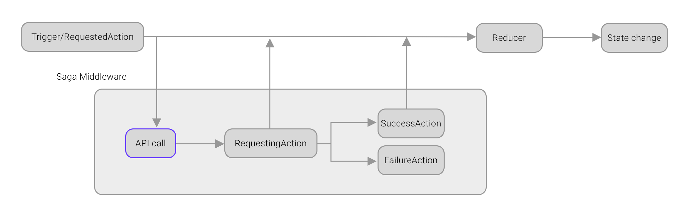
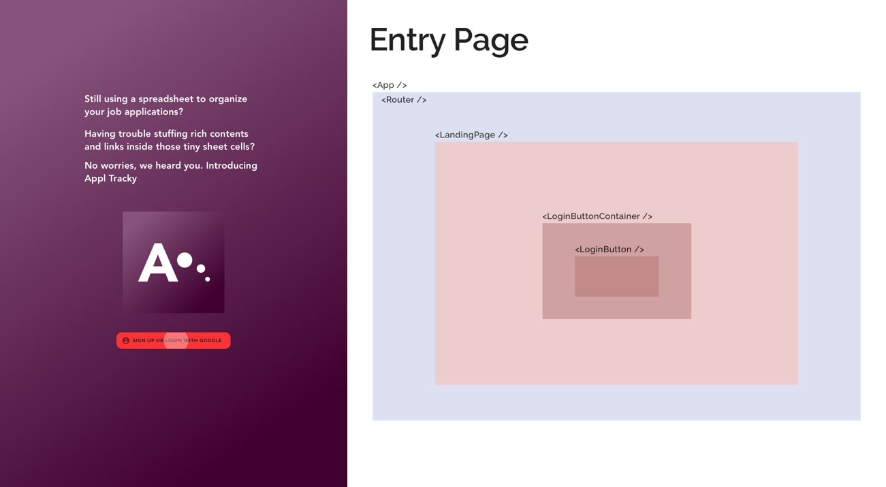
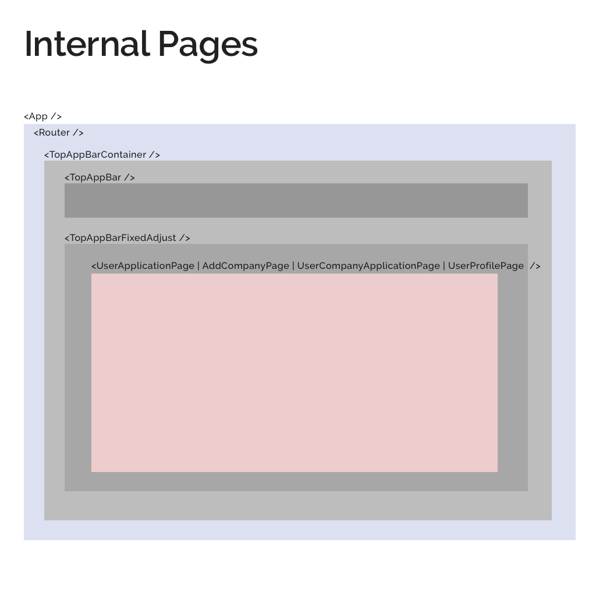
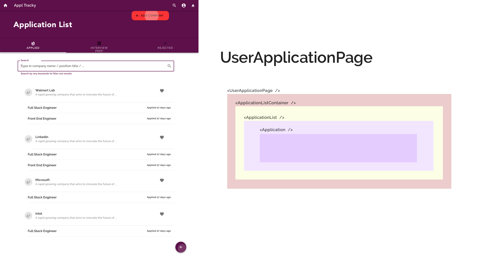
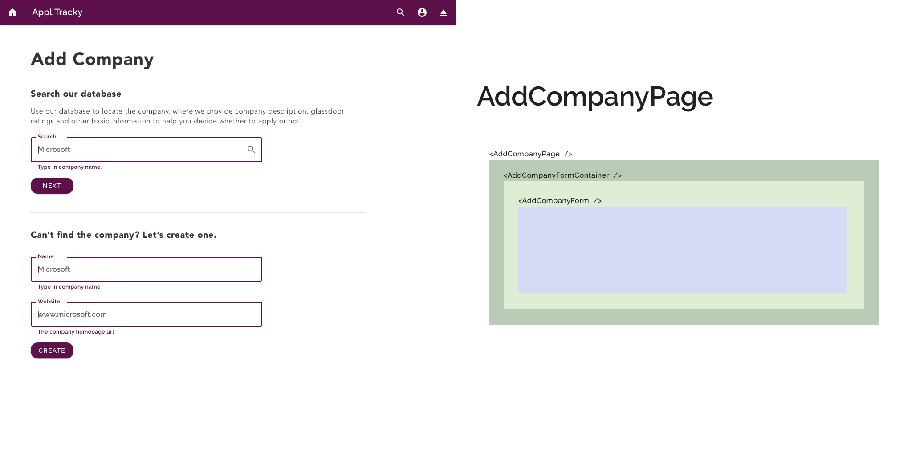
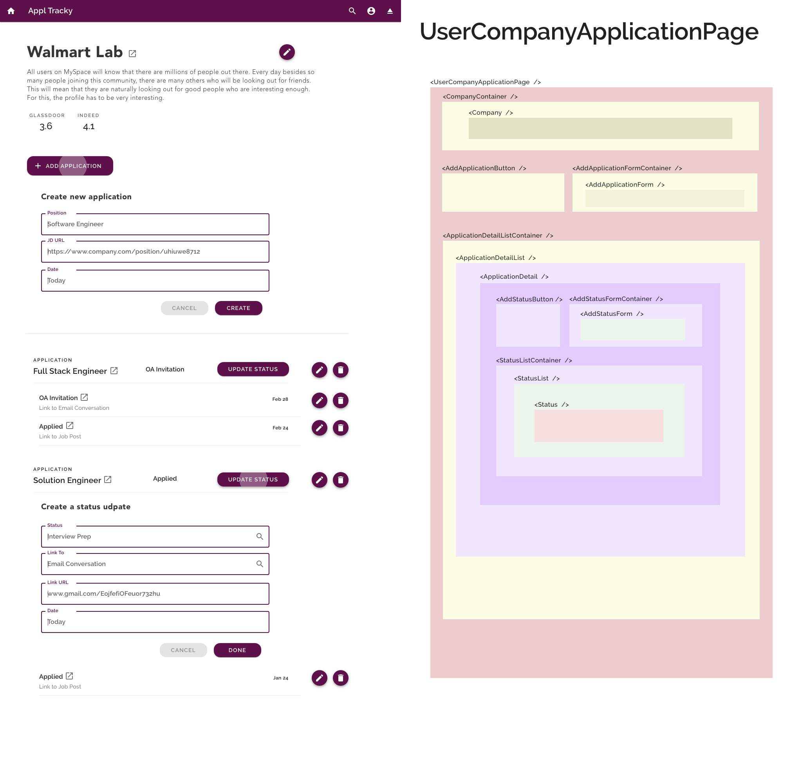
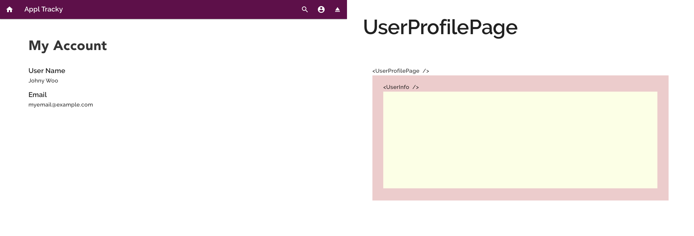

# Appl Tracky

Okay, Appl Tracky, I admit it's never the most creative name. It's more of an alias used during development. I'm sure we can figure out a cool, clever and design-ish app name. Before that, let's be patient and stick to `appl tracky` (after all, all the infrastructures e.g. load balancer, cluster, even subdomain, are either prefixed or suffixed after that ... ah-oh, damn!).

## What it does

Appl Tracky is a job application tracker that aims to replace your convoluted, messy spreadsheet workflow. It's common to use a spreadsheet to keep track of jobs you applied or want to apply for. It turns out, however, those small cells can only store text and are hard to scale. This app is designed to solve this problem - make the tracking easier, faster and more reliable. 

## Tech stack

### **Front End ([This Repo](https://github.com/rivernews/appl-tracky-spa)):** React

This is the main page for front end, also the primary public-facing page for the whole project. More details such as UI mockups will be covered in later sections in this document. For development progress and latest work, please refer to [`docs/dev`](docs/dev).

### **Back End ([Repo](https://github.com/rivernews/appl-tracky-api)):** Django w/ REST API, JWT & Social Auth

For more details about backend API server, please refer to the backend repo.

### **DevOps Infrastructure ([Repo](https://github.com/rivernews/iriversland2-kubernetes)):** Nginx (web server), ~~AWS~~ Kubernetes (host), Docker (virtualize), Terraform (provisioning)

Details about backend web (static) server, and other DevOps stuff, please refer to backend repo.

### Design

By Sketch.app!

## System Design

### Redux asynchronous action dispatching flow



## UI Mockups & Component Structure

Special credit to [The React + Redux Container Pattern](https://www.thegreatcodeadventure.com/the-react-plus-redux-container-pattern/) by Sophie DeBenedetto, the react component diagrams below are inspired by this post.

### Landing page



### Internal (Login) Page Routes



### Home page outlining all applications.



### Add a company to start registering applications for a company.



### Add updates to applications.



### User profile page.



## UX Design: Reflection for Frontend UI: 

Is this easier to use than spreadsheet? The UI should make the registering process as quick as possible. If we split into too many steps and pages, it'll dramatically slow down the process.
But sure, we're still not sure what is the best and what are the needs. We can always iterate the layout or process at a later point.

## Development experience

ES Linter [rules](https://eslint.org/docs/rules/), can be specified in `package.json`.

## Project Motivation

During this season of job searching (as of March 2019), many people must be crazy working with some spreadsheet keeping track of their job application, especially when you're applying for 50+ or even 100+. When a recruiter finally get back to you and invite you to an interview, you don't want to ask that disastrous question - "Could you tell me what is the position I was applying to?" Surprisingly, there aren't many tools out there so far - just google "job application track tool" and you'll see not many options. Seems like most of us are still using a spreadsheet, including me. An option out there is called Huntr (https://huntr.co/), and it looks like a Trello board. But it charges you once you add more than 40 records. The UI is beautiful, but it's a bit too complicate for me. 

In this project I want to build a Job Application Tracking System that can help you keep track of every application you sent and any hiring process you're currently in. Another thing I want to integrate into the system, is to have a Glassdoor/Indeed rating ready to review, so you can filter out companies that you don't think you want to work at first and stop wasting time going through the hiring process. Of course, rating is just one factor you might consider, there are way more like product, tech stack, team culture, and many things you can only know after you get into the process, but those are out of scope of this app. Anyway, in terms of data, first I'll retrieve a [dataset on company ratings](https://github.com/rivernews/fortune-500-analysis) from Glassdoor & Indeed, load that into database, then think of ways to port that in our system. Second, I'll build the tracking system for end users, which requires you to login. Once signed in, you can lookup a company's rating if there's one, you can start tracking application progress for a company, link to the job post, give a datetime, mark a status like "applied / technical interview prep / waiting (for interview time confirmation) ..." (ideally you can create your own status), and add some side notes. In terms of tech stack, we are having React + Django REST, so Django as an API, not doing too much, just serving the data.

## Light weight form framework

Inspired by Django's model and form framework.

### Basic concenpts

1. Field is the basic unit of this form framework. It can be a simple wrapper over `<input />`, or it can wrap a rich text field, or even "field of fields", e.g. a field containing several input fields.
    - You may ask why nested field, instead of a seperate form? This is because `<form>` cannot be nested in HTML. Cooperating with `Formik`, we can simulate a nested form, by creating a field that contains other fields. This is extremly useful when you want to create a dynamic form. Consider use case like one's "Work Experience", where user will want to input multiple work experiences,  and each work experience contains several fields like company name, duration, etc.
1. Start from data model - like table in database, each object type has a class to define its attributes. This class is called data model. The same concenpt in Django's model.
1. Form, is a collection of fields. You "max and match" several fields, to generate your form. On the other hand, form is coupled with data model. What fields you need for a form, will depend on your data model. There's a lot of space for customization, however, and you can decide what level of coupling with data model do you want.

### Adding fields to a form

1. You write a form component class.
1. In the constructor, specify the fields you want by including the **meta class of the fields**:

```ts
new FormLabelFieldMeta({
    fieldName: "labels",
    label: "Label",

    /* optional, defaults to false */
    /*
        This option lets you create nested, dynamic forms. It does things below:
        1. Let Formik value for the field be an array type. The object type will be handled for you - using the data model you have.
        2. The field will display a button "New Label" at first. After user click on it, user can generate a nested, child form that provides the field input(s). User can create as many forms as they want by clicking the button.
    */
    isDynamic: false, 
    
    /* optional, defaults to behavior in `form-base-field-meta` */
    /*
        In case you have a special need of transforming object shape, from values stored in Formik, to the request payload while submitting to your backend server API, you can do it here.
        But usually you don't need to, maybe changing the data model default value or your backend server will suffice.
    */
    getInstanceDataFromFormikValues: (values: FormikValues) => {
        return values["labels"];
    }
}),
```


