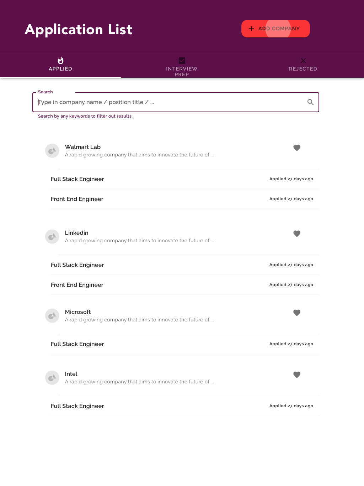
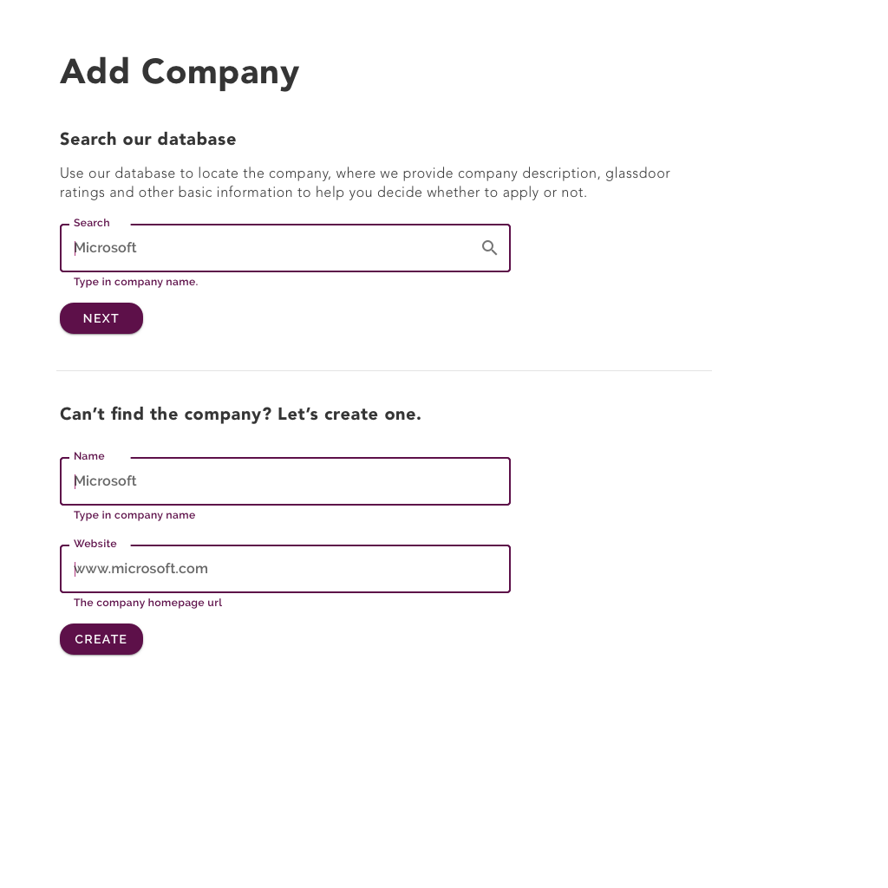
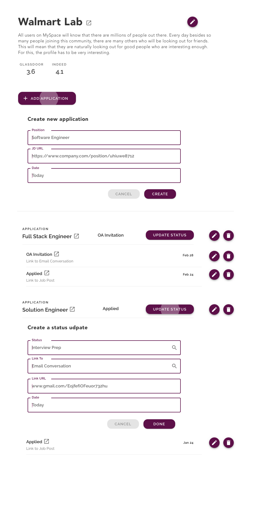

# Roadmap

- Testing w/ backend API permission
    - [x] ~~read objects~~ The API requires auth to access API. Without auth, nothing in API is accessible.
    - [ ] user auth setup - basic login/logout/username UI. Write a basic auth component
        - What we want to achieve
            - A unit that can manage login state
            - *not thinking about making an independent component, and how it interact w/ other component yet!*
        - Sketch the spec
            - @input == props: ?
            - UI user input == username, password
            - UI event trigger == login button
            - state (tided to UI view) == logged in username, login status
            - data == token data <--- **should I store this data in local var or in local state?**
            - @output == onChange when got token data <--- **How does React handle event / bottom-up data flow? What is the best practice**
        - Current action planned
            - Migrate current code into a new component.
                -  **What's best practice of React project folder structure?**
            - [x] Make the new component work with `App.tsx`
            - [x] display login status
            - [x] Send auth data in request! 🔥 🔥 🔥Need to solve the [`OPTION` problem](https://stackoverflow.com/questions/45557941/401-error-jwt-token-not-found-using-fetch).
                - [DRF's issue page discussing the issue](https://github.com/encode/django-rest-framework/issues/5616), mentioned the `django-cors-header` django app should solve the issue. [This post gives some clues of how to setup client and server headers](https://medium.com/@xinganwang/a-practical-guide-to-cors-51e8fd329a1f).
                - **Important**: Don't use Bearer! We are using jwt so use `JWT` instead! Also, when you don't have api login token yet, don't specify things in Authentication header, leave it empty. If you pass a `Authentication: JWT `, you'll be rejected by server.
            - [x] create an object (by POST) w/ login status
            - [x] update/delete an object
            - [ ] establish login/logout mechanism
                - Store login data as global state --> learn redux!
            - DONE. Fetch new action?
- [ ] Material UI: which library to use? Or build our own, or both? How about google's native mdc components?
- [ ] Build Navigation
- [ ] Build the UI (basic)
- [ ] Consider using Redux.

## Initial UI Design Mockups

Home page outlining all applications.

Add a company to start registering applications for a company.

Add updates to applications.

## Reflection for Frontend UI: 

Is this easier to use than spreadsheet? The UI should make the registering process as quick as possible. If we split into too many steps and pages, it'll dramatically slow down the process.
But sure, we're still not sure what is the best and what are the needs. We can always iterate the layout or process at a later point.

# Reference

Repos
- [This repo](https://github.com/rivernews/appl-tracky-spa)
- [The backend api repo](https://github.com/rivernews/appl-tracky-spa)

Production sites
- [Live production website](https://rivernews.github.io/appl-tracky-spa/)
- [Live backend endpoint](https://appl-tracky-api-https.shaungc.com/)

Technologies

- [How to use create-react-app](https://github.com/facebook/create-react-app)
- [**Use typescript with React**](https://alligator.io/react/typescript-with-react/#create-react-app-and-typescript) while using `create-react-app` to scaffold the project.
- [Deploy repo to github as a live website using gh-pages](https://github.com/gitname/react-gh-pages)
    - If you got a 404 page, and you made sure your homepage url is correct in `package.json`, chances are the page is updating so may need some time reflecting the new deployment. In short: be faithful & patient!

- Learnings & Readings
    - Generic
        - [5 Tools for Faster Development in React](https://blog.bitsrc.io/5-tools-for-faster-development-in-react-676f134050f2): project management tools, devTools, ...
    - Coding Style
        - [FB Official Doc: React Project's File Structure](https://reactjs.org/docs/faq-structure.html): "Don’t overthink it".
        - **[How To Write Better Code in React](https://blog.bitsrc.io/how-to-write-better-code-in-react-best-practices-b8ca87d462b0): Share and reuse components, propTypes , Know when to make new components**
    - Ways to do things
        - [Where to Hold React Component Data: state, store, static, and this](https://medium.freecodecamp.org/where-do-i-belong-a-guide-to-saving-react-component-data-in-state-store-static-and-this-c49b335e2a00): local state, redux, ...
        - [Is it bad practice to nest states in React?](https://stackoverflow.com/questions/51427445/is-it-bad-practice-to-nest-states-in-react). Should I nest state? Best practice to design state structure?
        - What is the equivalence of Angular @output, @input == onChange trigger, props in React?
    - Good quality UI libraries
        - **[11 React UI Component Libraries you Should Know in 2019](https://blog.bitsrc.io/11-react-component-libraries-you-should-know-178eb1dd6aa4): React Material-UI, Material Components Web, ...**
    - Reflections
        - A good way to get to know React is to compare Angular to its equivalance in React.
            - @input and @output
            - Service <---> state management?