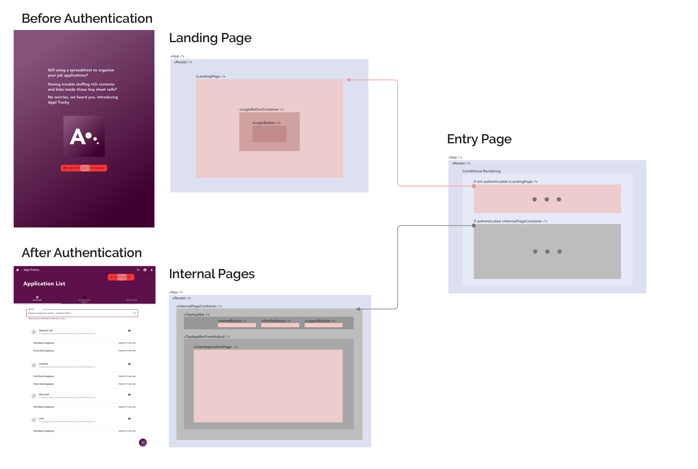

# Development Diary & Roadmap

- Testing w/ backend API permission
    - [x] ~~read objects~~ The API requires auth to access API. Without auth, nothing in API is accessible.
    - [ ] user auth setup - basic login/logout/username UI. Write a basic auth component
        - What we want to achieve
            - A unit that can manage login state
            - *not thinking about making an independent component, and how it interact w/ other component yet!*
        - Sketch the spec
            - @input == props: ?
            - UI user input == username, password
            - UI event trigger == login button
            - state (tided to UI view) == logged in username, login status
            - data == token data <--- **should I store this data in local var or in local state?**
            - @output == onChange when got token data <--- **How does React handle event / bottom-up data flow? What is the best practice**
        - Current action planned
            - Migrate current code into a new component.
                -  **What's best practice of React project folder structure?**
            - [x] Make the new component work with `App.tsx`
            - [x] display login status
            - [x] Send auth data in request! Need to solve the [`OPTION` problem](https://stackoverflow.com/questions/45557941/401-error-jwt-token-not-found-using-fetch).
                - [DRF's issue page discussing the issue](https://github.com/encode/django-rest-framework/issues/5616), mentioned the `django-cors-header` django app should solve the issue. [This post gives some clues of how to setup client and server headers](https://medium.com/@xinganwang/a-practical-guide-to-cors-51e8fd329a1f).
                - **Important**: Don't use Bearer! We are using jwt so use `JWT` instead! Also, when you don't have api login token yet, don't specify things in Authentication header, leave it empty. If you pass a `Authentication: JWT `, you'll be rejected by server.
            - [x] create an object (by POST) w/ login status
            - [x] update/delete an object
            - [ ] ⏸ <Component Design> establish login/logout mechanism
                - ⏸ Store login data as global state --> learn redux!
                - We found out that in order to build user auth, we will work on global login state, routing, and base navigation UI - all will be deeply coupled with and depend on the UI library - if we are using one. So, a better workflow might be to determine a UI library first (or build on our own from scratch). If we're using 3rd party library, we can have all the nav UI & routing support as well, hopefully the hook to user auth too. So we will move on and come back later.
            - DONE. Fetch new action?
- [ ] Material UI: which library to use? Or build our own, or both? How about google's native mdc components?
    - Besides links in the Reference section, can also refer to [our previous project research result](https://github.com/rivernews/si649-data-learn-viz-sort-public).
    - What we need: nav bar, tab, icon, ...
    - The [Official MDC for React](https://github.com/material-components/material-components-web-react/tree/master) looks great, but indeed if some components not provided, you have to write an adapter w/ the MDC vanilla JS.
    - There isn't any perfect one out there. So pick one, hopefully easy to customize, and start.
    - Material UI vs MDC-React
        - We're using MDC-React, but things like routing are not out of the box, probably less support than material UI, which has bigger community. (in terms of routing, actually material UI doesn't have that out of the box as well)
        - MDC-React's visual effect is closer to mockup, which uses mdc's themer.
        - Let's use MDC-React! And, we have to figure out react routing by ourselves. Time to get to work, dirty work!

### Building User Interface

**We'll skip details of UI, just the functionality first!**

- [x] Select a library, build routing, build Navigation
    - [x] We're using [MDC-React](https://github.com/material-components/material-components-web-react/tree/master) cuz closer to MDC design and so to our mockup.
    - [x] Use the top app bar ([API doc](https://github.com/material-components/material-components-web-react/tree/master/packages/top-app-bar), [demo page](https://material-components.github.io/material-components-web-catalog/#/component/top-app-bar)). Build routing. 
        - [react-router](https://reacttraining.com/react-router/web/guides/quick-start). We're using Typescript so will need [its type as well](https://www.npmjs.com/package/@types/react-router-dom).
            - Some issue with typing for `react-router`, [see this post](https://github.com/kstevens715/rubyles-previous/commit/90246949eadfa6fca08c6122652ff13dfd351079) to fix the `component` prop error that complaints `... is not assignable to ...`.
    - **We need some state management now: `<SocialAuth>` will login for us, but how can `<HomePage>` get that logged in state and udpate its view? (conditionally, either landing page or user home page)**
- [x] **Consider using Redux or context API to deal with global login status / state management.**
    - [We can use Redux](https://stackoverflow.com/a/49569203/9814131). Also for learning purpose. Watch out using w/ Typescript.
        - Learn [Redux basic](https://redux.js.org/introduction/getting-started)
            - Medium, 39K, [Understanding Redux: The World’s Easiest Guide to Beginning Redux](https://medium.freecodecamp.org/understanding-redux-the-worlds-easiest-guide-to-beginning-redux-c695f45546f6).
            - [Summarizing the 3 components of Redux](https://redux.js.org/introduction/three-principles). Fast and clear.
        - Learn [Redux + React](https://redux.js.org/basics/usage-with-react) (official). [A compact one.](https://medium.freecodecamp.org/a-beginners-guide-to-redux-9f652cbdc519).
            1. Write reducer functions, define action objects.
            1. Initiate the store object, wrap your app in it.
            1. Connecting the store (global state) to a local component using `connect()`, `mapStateToProps()`. This will "inject" part of the global state to your local component.
            1. Read/write to global store in local component: read the state by accessing `this.props.yourStatePropName`; write by calling `this.props.dispatch(actionObject)`, and React should handle the view update for you.
                - Note that by writing action creator functions, it's a good way to write more succinct code. In short, write action (creator) function instead of object. 
- [x] Learn [Redux + React + TypeScript](https://github.com/piotrwitek/react-redux-typescript-guide#redux---typing-patterns), **[official guide for typescript](https://redux.js.org/recipes/usage-with-typescript)**, or search google for more.
    - [Install dependencies](https://medium.com/@pongsatt/how-to-use-redux-in-typescript-ad0b5fe77933): `npm i -S react-redux`, `npm i -D @types/react-redux`
    - The official guide is not a good place to put together react, redux and typescript since it has to be un-opiniated. The github page for typing pattern is good, but it's more of best practice lookup, doesn't describe the flow to setup and the rationale behine each step. It'd be great if we can find a tutorial that puts these three together: react/redux/ts. 
    - [Really good post & Archi](https://blog.usejournal.com/using-react-with-redux-and-typescript-c7ec48c211f6).
    - We can now read store. 1) implement `mapStateToProps()`, 2) `connect()`.
    - Now how to write to store, i.e., dispatch? This will be done in `<SocialAuth />`.
- Know how to use `mapDispatchToProps()` in Typescript.
    - Know what is `mapDispatchToProps`
        - [SO Post: What is mapDispatchToProps?](https://stackoverflow.com/a/40068198/9814131)
        - [Container Components](https://medium.com/@learnreact/container-components-c0e67432e005)
    - Know how to use `mapDispatchToProps` in Typescript. (how to setup typings properly)
- [ ] Comply the "Container Component" convention / pattern. [The SO post](https://stackoverflow.com/a/40068198/9814131) describe what it actually looks like (also the Medium post in the answer), and [this post](https://www.thegreatcodeadventure.com/the-react-plus-redux-container-pattern/) has some really good illustration, and a high level step-by-step guide to use Container Component pattern to facilitate usage of dispatch.
    1. [x] Design our components and the structure.
    1. [x] Draw a put-everything-together tech mockup

#### Root Component Planning

- [x] Refactor root structure to reflect plan
- [x] Top App Bar - put a logout button, make sure it works. Can use isLogin:true to debuf top app bar.
- [x] Put a login button in landing page. Wire up update auth to redux store when logged in.
- [x] Test logisn/logout and see if conditional rendering works!

#### Initialize pages and navigations

🔥 🔥 🔥 

- [ ] Build the page UI (basic)

## UX Design: Reflection for Frontend UI: 

Is this easier to use than spreadsheet? The UI should make the registering process as quick as possible. If we split into too many steps and pages, it'll dramatically slow down the process.
But sure, we're still not sure what is the best and what are the needs. We can always iterate the layout or process at a later point.

# Reference

Repos
- [This repo](https://github.com/rivernews/appl-tracky-spa)
- [This repo dev diary](https://github.com/rivernews/appl-tracky-spa/tree/master/docs/dev)
- [The backend api repo](https://github.com/rivernews/appl-tracky-api)

Production sites
- [Live production website](https://rivernews.github.io/appl-tracky-spa/)
- [Live backend endpoint](https://appl-tracky-api-https.shaungc.com/)

Tools

- [Material Icons](https://material.io/tools/icons/)

Technologies

- [How to use create-react-app](https://github.com/facebook/create-react-app)
- [**Use typescript with React**](https://alligator.io/react/typescript-with-react/#create-react-app-and-typescript) while using `create-react-app` to scaffold the project.
- [Deploy repo to github as a live website using gh-pages](https://github.com/gitname/react-gh-pages)
    - If you got a 404 page, and you made sure your homepage url is correct in `package.json`, chances are the page is updating so may need some time reflecting the new deployment. In short: be faithful & patient!

- Learnings & Readings
    - Generic
        - [5 Tools for Faster Development in React](https://blog.bitsrc.io/5-tools-for-faster-development-in-react-676f134050f2): project management tools, devTools, ...
    - Coding Style
        - [FB Official Doc: React Project's File Structure](https://reactjs.org/docs/faq-structure.html): "Don’t overthink it".
        - **[How To Write Better Code in React](https://blog.bitsrc.io/how-to-write-better-code-in-react-best-practices-b8ca87d462b0): Share and reuse components, propTypes , Know when to make new components**
    - Ways to do things
        - [Where to Hold React Component Data: state, store, static, and this](https://medium.freecodecamp.org/where-do-i-belong-a-guide-to-saving-react-component-data-in-state-store-static-and-this-c49b335e2a00): local state, redux, ...
        - [Is it bad practice to nest states in React?](https://stackoverflow.com/questions/51427445/is-it-bad-practice-to-nest-states-in-react). Should I nest state? Best practice to design state structure?
        - What is the equivalence of Angular @output, @input == onChange trigger, props in React?
    - Good quality UI libraries
        - **[11 React UI Component Libraries you Should Know in 2019](https://blog.bitsrc.io/11-react-component-libraries-you-should-know-178eb1dd6aa4): React Material-UI, Material Components Web, ...**
    - Reflections
        - A good way to get to know React is to compare Angular to its equivalance in React.
            - @input and @output
            - Service <---> state management?

Caveats & Troubleshooting

- Interface optional callback dilemma. See [SO: Declare optional Event callback in Typescript React](https://stackoverflow.com/a/52367308/9814131) for solution.