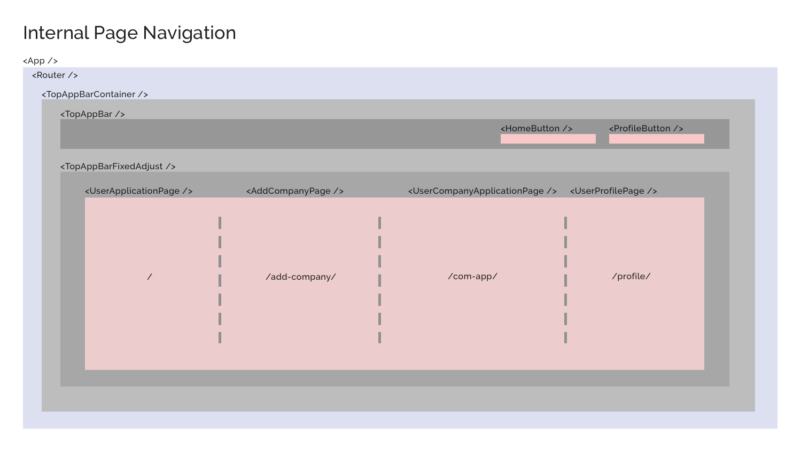

# Development Diary & Roadmap

## Hook up React and Backend REST API

- Testing w/ backend API permission
    - [x] ~~read objects~~ The API requires auth to access API. Without auth, nothing in API is accessible.
    - [ ] user auth setup - basic login/logout/username UI. Write a basic auth component
        - What we want to achieve
            - A unit that can manage login state
            - *not thinking about making an independent component, and how it interact w/ other component yet!*
        - Sketch the spec
            - @input == props: ?
            - UI user input == username, password
            - UI event trigger == login button
            - state (tided to UI view) == logged in username, login status
            - data == token data <--- **should I store this data in local var or in local state?**
            - @output == onChange when got token data <--- **How does React handle event / bottom-up data flow? What is the best practice**
        - Current action planned
            - Migrate current code into a new component.
                -  **What's best practice of React project folder structure?**
            - [x] Make the new component work with `App.tsx`
            - [x] display login status
            - [x] Send auth data in request! Need to solve the [`OPTION` problem](https://stackoverflow.com/questions/45557941/401-error-jwt-token-not-found-using-fetch).
                - [DRF's issue page discussing the issue](https://github.com/encode/django-rest-framework/issues/5616), mentioned the `django-cors-header` django app should solve the issue. [This post gives some clues of how to setup client and server headers](https://medium.com/@xinganwang/a-practical-guide-to-cors-51e8fd329a1f).
                - **Important**: Don't use Bearer! We are using jwt so use `JWT` instead! Also, when you don't have api login token yet, don't specify things in Authentication header, leave it empty. If you pass a `Authentication: JWT `, you'll be rejected by server.
            - [x] create an object (by POST) w/ login status
            - [x] update/delete an object
            - [ ] ⏸ <Component Design> establish login/logout mechanism
                - ⏸ Store login data as global state --> learn redux!
                - We found out that in order to build user auth, we will work on global login state, routing, and base navigation UI - all will be deeply coupled with and depend on the UI library - if we are using one. So, a better workflow might be to determine a UI library first (or build on our own from scratch). If we're using 3rd party library, we can have all the nav UI & routing support as well, hopefully the hook to user auth too. So we will move on and come back later.
            - DONE. Fetch new action?
- [ ] Material UI: which library to use? Or build our own, or both? How about google's native mdc components?
    - Besides links in the Reference section, can also refer to [our previous project research result](https://github.com/rivernews/si649-data-learn-viz-sort-public).
    - What we need: nav bar, tab, icon, ...
    - The [Official MDC for React](https://github.com/material-components/material-components-web-react/tree/master) looks great, but indeed if some components not provided, you have to write an adapter w/ the MDC vanilla JS.
    - There isn't any perfect one out there. So pick one, hopefully easy to customize, and start.
    - Material UI vs MDC-React
        - We're using MDC-React, but things like routing are not out of the box, probably less support than material UI, which has bigger community. (in terms of routing, actually material UI doesn't have that out of the box as well)
        - MDC-React's visual effect is closer to mockup, which uses mdc's themer.
        - Let's use MDC-React! And, we have to figure out react routing by ourselves. Time to get to work, dirty work!

## UI Library & State Management Setup

**We'll skip details of UI, just the functionality first!**

- [x] Select a library, build routing, build Navigation
    - [x] We're using [MDC-React](https://github.com/material-components/material-components-web-react/tree/master) cuz closer to MDC design and so to our mockup.
    - [x] Use the top app bar ([API doc](https://github.com/material-components/material-components-web-react/tree/master/packages/top-app-bar), [demo page](https://material-components.github.io/material-components-web-catalog/#/component/top-app-bar)). Build routing. 
        - [react-router](https://reacttraining.com/react-router/web/guides/quick-start). We're using Typescript so will need [its type as well](https://www.npmjs.com/package/@types/react-router-dom).
            - Some issue with typing for `react-router`, [see this post](https://github.com/kstevens715/rubyles-previous/commit/90246949eadfa6fca08c6122652ff13dfd351079) to fix the `component` prop error that complaints `... is not assignable to ...`.
    - **We need some state management now: `<SocialAuth>` will login for us, but how can `<HomePage>` get that logged in state and udpate its view? (conditionally, either landing page or user home page)**
- [x] **Consider using Redux or context API to deal with global login status / state management.**
    - [We can use Redux](https://stackoverflow.com/a/49569203/9814131). Also for learning purpose. Watch out using w/ Typescript.
        - Learn [Redux basic](https://redux.js.org/introduction/getting-started)
            - Medium, 39K, [Understanding Redux: The World’s Easiest Guide to Beginning Redux](https://medium.freecodecamp.org/understanding-redux-the-worlds-easiest-guide-to-beginning-redux-c695f45546f6).
            - [Summarizing the 3 components of Redux](https://redux.js.org/introduction/three-principles). Fast and clear.
        - Learn [Redux + React](https://redux.js.org/basics/usage-with-react) (official). [A compact one.](https://medium.freecodecamp.org/a-beginners-guide-to-redux-9f652cbdc519).
            1. Write reducer functions, define action objects.
            1. Initiate the store object, wrap your app in it.
            1. Connecting the store (global state) to a local component using `connect()`, `mapStateToProps()`. This will "inject" part of the global state to your local component.
            1. Read/write to global store in local component: read the state by accessing `this.props.yourStatePropName`; write by calling `this.props.dispatch(actionObject)`, and React should handle the view update for you.
                - Note that by writing action creator functions, it's a good way to write more succinct code. In short, write action (creator) function instead of object. 
- [x] Learn [Redux + React + TypeScript](https://github.com/piotrwitek/react-redux-typescript-guide#redux---typing-patterns), **[official guide for typescript](https://redux.js.org/recipes/usage-with-typescript)**, or search google for more.
    - [Install dependencies](https://medium.com/@pongsatt/how-to-use-redux-in-typescript-ad0b5fe77933): `npm i -S react-redux`, `npm i -D @types/react-redux`
    - The official guide is not a good place to put together react, redux and typescript since it has to be un-opiniated. The github page for typing pattern is good, but it's more of best practice lookup, doesn't describe the flow to setup and the rationale behine each step. It'd be great if we can find a tutorial that puts these three together: react/redux/ts. 
    - [Really good post & Archi](https://blog.usejournal.com/using-react-with-redux-and-typescript-c7ec48c211f6).
    - We can now read store. 1) implement `mapStateToProps()`, 2) `connect()`.
    - Now how to write to store, i.e., dispatch? This will be done in `<SocialAuth />`.
- Know how to use `mapDispatchToProps()` in Typescript.
    - Know what is `mapDispatchToProps`
        - [SO Post: What is mapDispatchToProps?](https://stackoverflow.com/a/40068198/9814131)
        - [Container Components](https://medium.com/@learnreact/container-components-c0e67432e005)
    - Know how to use `mapDispatchToProps` in Typescript. (how to setup typings properly)
- [ ] Comply the "Container Component" convention / pattern. [The SO post](https://stackoverflow.com/a/40068198/9814131) describe what it actually looks like (also the Medium post in the answer), and [this post](https://www.thegreatcodeadventure.com/the-react-plus-redux-container-pattern/) has some really good illustration, and a high level step-by-step guide to use Container Component pattern to facilitate usage of dispatch.
    1. [x] Design our components and the structure.
    1. [x] Draw a put-everything-together tech mockup

## Root Component Planning & User Authentication (Login)


- [x] Refactor root structure to reflect plan
- [x] Top App Bar - put a logout button, make sure it works. Can use isLogin:true to debuf top app bar.
- [x] Put a login button in landing page. Wire up update auth to redux store when logged in.
- [x] Test logisn/logout and see if conditional rendering works!

## Initialize Pages, Routings and Navigations

React component planning - navigation and routed pages:



- [x] Initialize page components for user app/add com/user com app page
- [x] Add minimal necessary UI for navigation
- [ ] Add navigation transition between pages
    - [x] Resolve issue when [using redux with react-router](https://stackoverflow.com/a/42124328/9814131). Also how to navigate progamically.
        - [What is `exact` in `<Route>`](https://stackoverflow.com/questions/49162311/react-difference-between-route-exact-path-and-route-path)
        - How to get `params` from route?
            1. Router: define the route `<Route path="/to/your/page/:param/">`
            1. Source page: either use `<Link to="/to/your/page/param-value-here/">` or `<a href ...>`
            1. To navigate programatically, or retreieve `params`, you need react-router's props "injected" into your component's prop first. There are three router props: `location`, `history` and `match`, and after injected, you can access them in your component like `this.props.location`.
                - `this.props.history.push("to/your/page/param-vale/")` will let you navigate programatically.
                - `this.props.match.params["param-value"]` will let you retrieve `params`.
            1. To inject these props, first `import { RouteComponentProps, withRouter } from "react-router-dom";`
            1. `withRouter` will inject router props to your component props. Wrap your redux `connect()` in it and use it like `export default withRouter(connect(...)(YourComponent));`.
            1. `RouteComponentProps` is for your component's props type checking. There're many ways to setup, but basically, you can use `RouteComponentProps` literally as type, this will give typings for the three router props: `location`, `history` and `match`. To also do strict type checking on `params`, you can define a `IParamsInterface` and use it like `RouteComponentProps<IParamsInterface>`. Then, the `IParamsInterface` will do type checking on `this.props.match.params`.
            1. To put this router props typing to your component's props, there're many way to do it:
                - If you already have a component props interface, you can let it extend `RouteComponentProps<IParamsInterface>`. Or if your component don't need to retrieve `params` and just want the router props, then you can do `interface IMyComponentProps extends RouteComponentProps { ... }`
                - If your component doesn't have props interface, you can just use router props typing directly on the component like `class MyComponent<RouteComponentProps> extends React.Component {...}`. 


    - [x] Login/logout nav is done, but add company button we have some issues. Seems like it forces refresh, and so our global store is lost. Solution: change `href` to `onClick` and navigate programatically.

### Managing various phases for a http-request-related (i.e. Aync) redux action?

Keywords: async action, api, request, data fetch + redux + typescript

- If action failed, how can we know and how to change the view to reflect the error state? If action takes a long time, how can we have an intermediate state and have the view change correspondedly?

First of all, there must be a place to 1) handle API request, e.g. a Promise that has `.then()` and `.catch()` block. Then there should be someone to 2) trigger updates on views, or, 2) trigger updates on state plus a 3) conditional rendering logic in view or side effects updating the view.

**Three Aync Key Parts:**

1. API request and response handling
1. Trigger state update
1. State change reflects on view change, perhaps by conditional rendering

When considering redux in this setting, redux can handle state updating, and provide its state for conditional rendering. However, it does not do API request, so all the `fetch()`, `.then()`, `.catch()` cannot be in redux. Also, it cannot do any side effects to udpate the view, say, navigate to another page, in any of `reducer` and `action`.

Putting this all together, first, as a transition from synchronous to asynchronous, one action now has to be extended to 3 or even more actions, to distinguish states like start request, request success, request fail (or timeout). In terms of store structure, it will at least add a new property e.g. status, that can store the async state = requesting, succeed, failed, ....

After some preliminary research, seems like we can use `react-thunk` or `react-saga`. But what the heck are they doing? Time for having a cup of coffee and read!

- [Redux-Thunk vs. Redux-Saga](https://decembersoft.com/posts/redux-thunk-vs-redux-saga/)
    - Redux-Thunk: middleware for action creators. thunk --hijacks-- action creator --creates-- action --dispatches-- reducer --changes-- state/store. In terms of the async key parts mentioned above, the 1st step happens in the "thunk" aka middleware. 2nd step is the action creator & dispatch. 3rd step will be implement elsewhere in your component.
    - Redux-Saga: a generator version of redux-thunk, and has some benefits over it. But also more complicated.
    - *Article does not touch on step by step tutorial to use either of them.
- [Redux-Thunk vs. Redux-Saga @ Medium](https://medium.com/@shoshanarosenfield/redux-thunk-vs-redux-saga-93fe82878b2d)
- Supplementary
    - [Redux official: Async Actions](https://redux.js.org/advanced/async-actions)
    - [Asynchronous Redux Actions Using Redux Thunk @ Alligator.io](https://alligator.io/redux/redux-thunk/)

- Seems like saga is a popular choice, but is quite complicated. 
    - **[This quick small redux-saga tutorial](https://flaviocopes.com/redux-saga/) sets up a in-depth yet quick saga example**.
    - [This is redux-saga's official tutorial](https://redux-saga.js.org/docs/introduction/BeginnerTutorial.html) 🔥🔥
- To test out saga, we do need a typescript setup. Including how to install typings.
    - `npm i -S redux-saga`.
    - But seems like there're little tutorial about step by step setup for ts+redux-saga. We can just use `any` type as a work around as for now. As such, the saga official tutorial becomes quite valuable.
- Start thinking about what actions & what reducers you need for API call.
    - login/logout action? or combined as single action (but are their associated async action set the same)?
    - associated API call actions basics - request, success, fail.
    - Also a API call utility function.
        - [x] We have a REST API class now. Then, give another util for login/logout. (handle both social auth & backend auth)
        - [x] Then use these util func to write your update auth saga.
        - But - are we going to write request/success/fail for all api actions in the future? Indeed it's repetitive and tedious. See this [redux action routine package](https://github.com/afitiskin/redux-saga-routines) to automatically create those for you.

- OK, we finish sagas and now the login should work, theoretically. But, we use programatical navigation. How do we do navigation in saga?
    - [`connect-react-router`](https://github.com/supasate/connected-react-router#usage) to the rescue. It basically connects router and redux, so you can access router history object to navigate from redux store.
    - **[Can follow this post](https://ruddra.com/posts/control-application-flow-from-redux-middleware/) to setup `connect-react-router` and, eventually, navigate in saga**.
    - Debug: somehow `push()` is not working in saga. [Based on this github issue](https://github.com/supasate/connected-react-router/issues/260), we are trying to downgrade from `"connected-react-router": "^6.3.2",` to `"connected-react-router": "6.0.0",`. --> doesn't help
        - `"react-router-dom": "^4.3.1",` upgrade to `"5.0.0"` and see how that goes.
        - Just use `<Router>` instead of `<ConnectedRouter>`?
        - Turns out it's the way we call `push` in our saga! [Inspired by this post](https://decembersoft.com/posts/changing-react-route-programmatically-with-redux-saga/).

Instead of
```js
...
put(push("/home/"));
yield put(SuccessAuth(authentication.state.userEmail, ""));
...
```

We should write
```js
...
yield put(SuccessAuth(authentication.state.userEmail, ""));
yield put(push("/home/"));
...
```

`yield [put(SuccessAuth(authentication.state.userEmail, "")), put(push("/home/"))];` won't work as well. [See this post](https://stackoverflow.com/a/47623129/9814131).

🎉🎉🎉

- [x] Add logout POST to django server

- Since we now need two sagas - one for logout and another for login, we need to have a root saga, and then branch out. There are several ways to include multiple sagas in the root. Common options are `all()`, `fork()`, `spawn()`, and a combination of them. [See this RootSaga section](https://redux-saga.js.org/docs/advanced/RootSaga.html) of the redux-saga official for trade offs. We will use the simpliest case here, but as the app scale, we might want to switch to `spawn()`.

- Login / logout using API w/ saga done!! 🎉 🎉 🎉 !!
- Our previous try catch block in saga is not working. We don't handle `fetch`'s then catch in the rest api object; instead, we just return `fetch()`, then the try catch block in saga will work. [See this post.](https://stackoverflow.com/questions/40007935/how-to-handle-errors-in-fetch-responses-with-redux-saga)
- Where to store api token? Because we want to handle try/catch in saga, we cannot `then()` in authentication object as well. The recommended way is to put that in global store, and access it only in saga. Of course, this means all API calls have to go through saga. --> Actually you can leave the `then()` in authentication, and just don't use `catch()` there. But yes, best practice still, access store in saga, and store is the only "single source of truth". [See this post](https://stackoverflow.com/questions/37772877/how-to-get-something-from-the-state-store-inside-a-redux-saga-function) to get store in saga. (You have to create a `selector` function)

- [x] Extra points - route gaurd for authentication.
    - Turns out that by doing this, we actually don't need `push()` in saga anymore - because our redirection in public/private routes automatically does this.

## CRUD-functioning User Interface

- Think about next steps - "CRUD" & forms to create com & app & status 🔥 🔥 🔥 
    - Stepping into [Formik](https://jaredpalmer.com/formik/docs/overview). Install `npm install formik --save`.
    - Install [input fields from mdc-react](https://github.com/material-components/material-components-web-react/tree/master/packages/text-field): `npm install @material/react-text-field`.
    - Also prepare to [material icon](https://material.io/tools/icons/?search=add&style=baseline)!
- [ ] Reflection on next steps and roadmaps.

# Reference

Repos
- [This repo](https://github.com/rivernews/appl-tracky-spa)
- [This repo dev diary](https://github.com/rivernews/appl-tracky-spa/tree/master/docs/dev)
- [The backend api repo](https://github.com/rivernews/appl-tracky-api)

Production sites
- [Live production website](https://rivernews.github.io/appl-tracky-spa/)
- [Live backend endpoint](https://appl-tracky-api-https.shaungc.com/)

Tools

- [Material Icons](https://material.io/tools/icons/)
- [How to write VScode snippet](https://code.visualstudio.com/docs/editor/userdefinedsnippets)
- [React Router quick reference to match, location and history](https://medium.freecodecamp.org/hitchhikers-guide-to-react-router-v4-4b12e369d10)

Technologies

- [How to use create-react-app](https://github.com/facebook/create-react-app)
- [**Use typescript with React**](https://alligator.io/react/typescript-with-react/#create-react-app-and-typescript) while using `create-react-app` to scaffold the project.
- [Deploy repo to github as a live website using gh-pages](https://github.com/gitname/react-gh-pages)
    - If you got a 404 page, and you made sure your homepage url is correct in `package.json`, chances are the page is updating so may need some time reflecting the new deployment. In short: be faithful & patient!

- Learnings & Readings
    - Generic
        - [5 Tools for Faster Development in React](https://blog.bitsrc.io/5-tools-for-faster-development-in-react-676f134050f2): project management tools, devTools, ...
    - Coding Style
        - [FB Official Doc: React Project's File Structure](https://reactjs.org/docs/faq-structure.html): "Don’t overthink it".
        - **[How To Write Better Code in React](https://blog.bitsrc.io/how-to-write-better-code-in-react-best-practices-b8ca87d462b0): Share and reuse components, propTypes , Know when to make new components**
    - Ways to do things
        - [Where to Hold React Component Data: state, store, static, and this](https://medium.freecodecamp.org/where-do-i-belong-a-guide-to-saving-react-component-data-in-state-store-static-and-this-c49b335e2a00): local state, redux, ...
        - [Is it bad practice to nest states in React?](https://stackoverflow.com/questions/51427445/is-it-bad-practice-to-nest-states-in-react). Should I nest state? Best practice to design state structure?
        - What is the equivalence of Angular @output, @input == onChange trigger, props in React?
    - Good quality UI libraries
        - **[11 React UI Component Libraries you Should Know in 2019](https://blog.bitsrc.io/11-react-component-libraries-you-should-know-178eb1dd6aa4): React Material-UI, Material Components Web, ...**
    - Reflections
        - A good way to get to know React is to compare Angular to its equivalance in React.
            - @input and @output
            - Service <---> state management?

Caveats & Troubleshooting

- Interface optional callback dilemma. See [SO: Declare optional Event callback in Typescript React](https://stackoverflow.com/a/52367308/9814131) for solution.